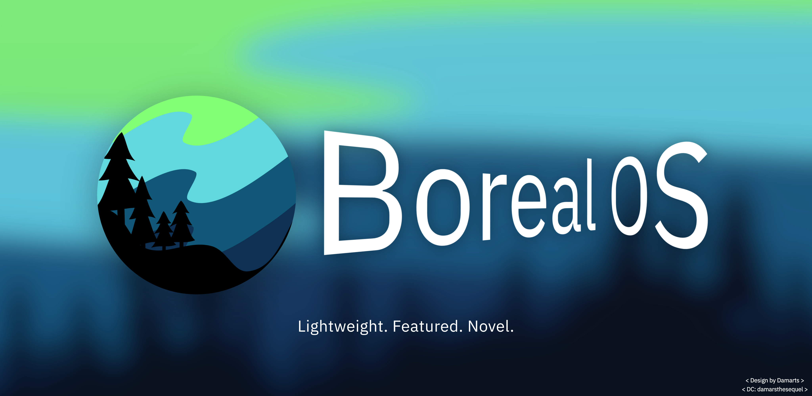

- BorealOS is a Debian-based desktop Linux distribution for x86_64 systems. It aims to provide an optimized Debian experience without systemd, using Dinit.

 

## Concept

| Area | Plans |
|---|---|
| Base | Debian-based |
| Architecture | x86_64 for now |
| Target users | Intermediate Linux users |
| Init system | Dinit |
| Shells | `sh` & `fish`|
| Documentation | Documentation first, with focus on Man pages |

 

## Key Features

- Own unit system forked off of systemd keeping compatibility but lighter.
- Debain-based desktop operating system.
- Community-driven development.
- Pre-riced desktops and window managers.
- Warnings before risky operations.
- Documentation-first approach with focus on man pages.

 

## Supported Desktops

BorealOS plans to support three graphical interfaces as a choice during setup:

- KDE Plasma
- XFCE
- Sway

 

## Shell

The project uses the `sh` shell by default, with the choice in setup to use the `fish` shell 

 

## Documentation

Planned documentation areas include:

- Installation guide
- Man pages
- Init system usage
- Desktop environment / Window manager customization
- Troubleshooting

 

## Development Status

BorealOS is currently in the early repository-structure and build-planning phase.

The first technical milestone is a minimal Debian-based ISO that boots in a
virtual machine with `Dinit` as PID 1.

 

## Cat

